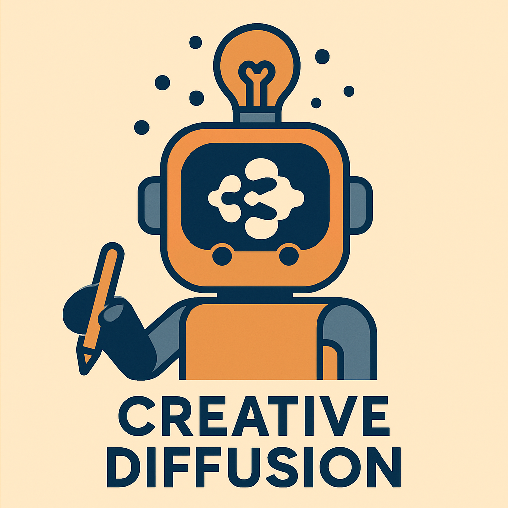
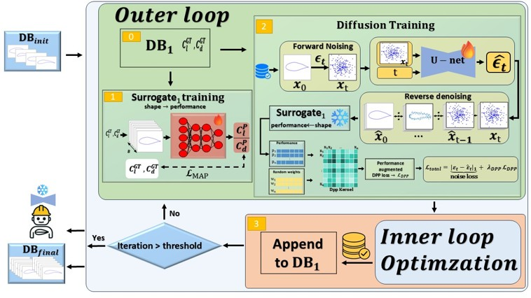
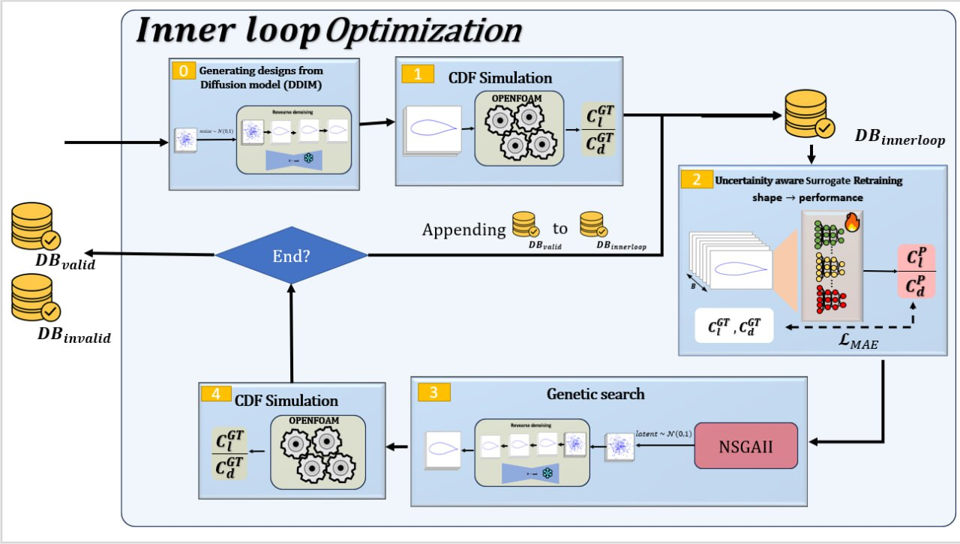

# Diff-MOBO 




---

## Paper
**Title**: Diff-MOBO : Diffusion-Guided Multi-Objective Bayesian Optimization for
Creative Engineering Design  
**Authors**: [Mahan Veisi](https://github.com/MahanVeisi8),  Bardiya Kariminia, Navid Ansari, Kevin Tirta Wijaya, Vahid Babaei

## Overview

<p align="center">
  
</p>


<p align="center">
  
</p>


---

## Quickstart

**Option A — CPU-only (surrogate evaluation):**

```bash
python -m venv .venv && source .venv/bin/activate  # (Windows) .venv\Scripts\activate
pip install -U pip
pip install -r src/optimization_loop/requirements.txt

python src/optimization_loop/outerloop_creation.py \
  --mode surrogate --n_samples 64 \
  --out artifacts/run_$(date +%Y%m%d_%H%M%S)/results.npy
````

**Option B — Full physics (OpenFOAM in Docker):**

1. Load the prebuilt image `airfoil_docker.tar` and start a container that **mounts the repo**.
2. Inside the container, source OpenFOAM and install Python deps once.
3. From your host, run the outer loop script (it will `docker exec` to evaluate shapes).

See full steps: [Docker/OpenFOAM setup](src/optimization_loop/docker_openfoam_setup_tutorial_full.md).

---

## Structure

```
.
├─ notebooks/                   # Experiments and demos (organized by stage)
│   ├─ 00_overview/             # End-to-end workflows
│   ├─ 10_generation/           # Training & sampling diffusion models
│   ├─ 20_evaluation/           # Evaluation and ablations
│   ├─ 30_openfoam/             # CFD coupling demos
│   └─ 90_archive/              # Legacy or alternate experiments
│
├─ src/
│   ├─ diffusion_core/          # Diffusion model (datasets, model, diffusion, utils)
│   ├─ OpenFoam/                # CFD coupling and runner scripts (keep as-is)
│   ├─ optimization_loop/       # Outer loop orchestrator
│   │   ├─ outerloop_creation.py
│   │   └─ docker_openfoam_setup_tutorial_full.md
│   └─ surrogate_models/        # Surrogate models for fast evaluation
│
├─ artifacts/                   # Run outputs, weights, results (Git LFS)
├─ assets/                      # Figures, logos, diagrams
├─ .gitignore
└─ README.md (this file)
```

---

## Notebooks

* **Colab (Main Flow):** [GenerativeAirfoil (Main Flow)](https://colab.research.google.com/drive/1q9PG53IRJTT7E0KyeFvqGBovLTQtffT9?usp=sharing)
* **Kaggle:**

  * [Mahan’s notebook](https://www.kaggle.com/code/mahanveisi/generativeairfoil)
  * [Bardia’s DPP notebook](https://www.kaggle.com/code/bardiyakariminia/generative-dpp-airfoil)

> If a Kaggle notebook is not accessible, please contact **Mahan** to grant access.

---

## Installation

```bash
python -m venv .venv && source .venv/bin/activate  # (Windows) .venv\Scripts\activate
pip install -U pip
pip install -r src/optimization_loop/requirements.txt
```

---

## Usage

**Outer loop**:

```bash
python src/optimization_loop/outerloop_creation.py \
  --container airfoil_mount \
  --n_samples 64 \
  --out artifacts/run_$(date +%Y%m%d_%H%M%S)/results.npy \
  --mode openfoam      # or surrogate
```

Outputs are saved under `artifacts/run_YYYYmmdd_HHMMSS/`.

---

## Planned Refactor

* Package modules under `airfoil/`
* CLI: `airfoil generate`, `airfoil simulate`, `airfoil outer-loop`
* Config via Hydra or pydantic
* Standardized results under `artifacts/`
* Testing (dataset shape checks, surrogate round-trip, diffusion sampling)

---

## License

MIT (see `LICENSE`).


